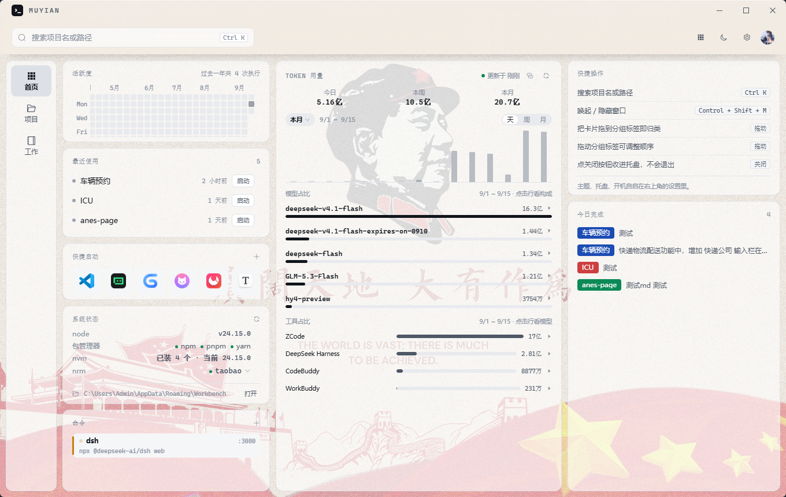
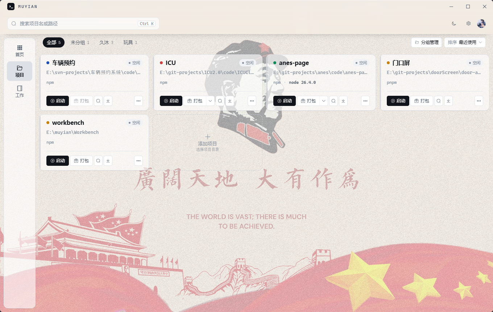
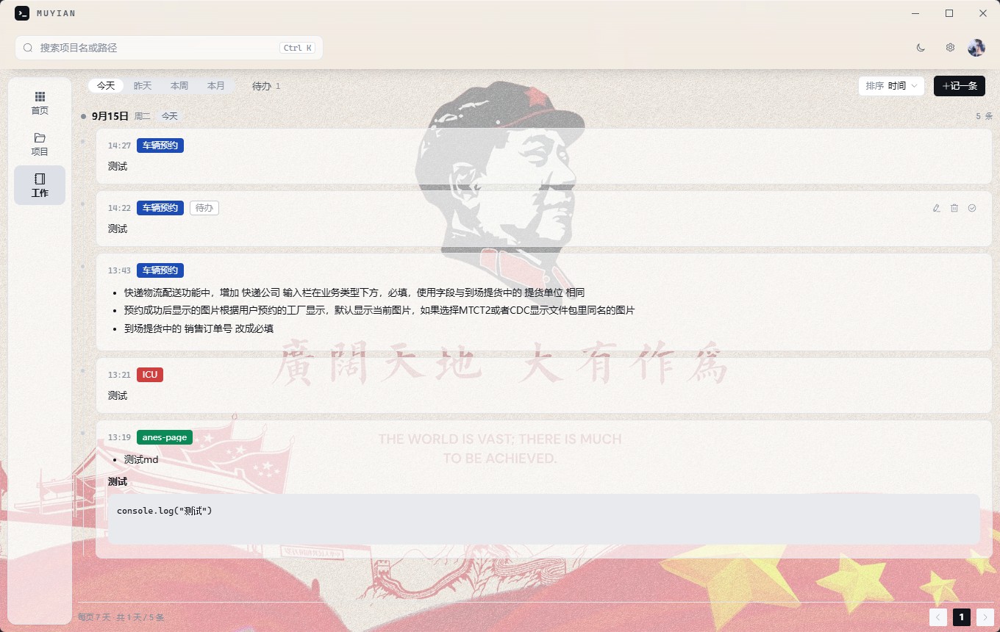
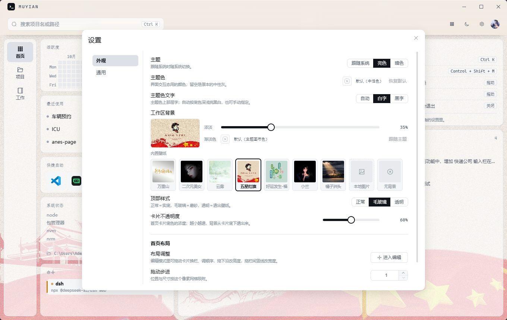

# Workbench

一个跑在 Windows 上的本地开发工作台 —— 管项目、记工作、写笔记、看 AI 用量。

一次添加项目目录，之后一键装依赖、一键启动、一键打包；命令输出在应用内的终端面板里实时可见，随时可停。
此外还有一块可自由布局的首页看板（AI 编程用量、命令活跃度、本机环境、常用软件），
一条按天分组的工作日志，以及一个本机的 markdown 笔记本。

数据都在本机，默认不联网。Tauri 2 + Vue 3 写成。

| 首页 —— 可自由布局的工作台 | 项目 —— 一键启停与打包 |
|---|---|
|  |  |
| 工作 —— 按天分组的工作日志 | 设置 —— 外观与通用 |
|  |  |

## 能做什么

- **首页工作台**：八块可自由布局的卡片（活跃度、Token 用量、系统状态、最近使用、快捷操作、快捷启动、命令、今日完成），卡片位置、栏宽与高度随拖随存。
- **项目管理**：选目录即读 `package.json`，认出框架、scripts、锁文件与包管理器；支持分组、排序、项目标识色，目录被挪走可重新定位。
- **一键操作**：安装依赖 / 启动 / 打包 / 停止 / 重启。打包完自动打开产物目录；从启动日志里认出端口，被别的进程占用时提示占用者并可直接结束它。
- **终端面板**：同一项目的一类操作各占一个 Tab，输出互不覆盖，停止按进程树收干净；面板可收进窗口右缘的一颗悬浮按钮。
- **聚合搜索**：顶栏一个框搜所有项目，按来源分组、键盘上下选择，回车跳到那张卡上。
- **工作日志**：按天分组的时间轴，记录可关联项目、标待办 / 已完成，正文按 markdown 渲染。**只在本机**：它不写进数据文件、也不随同步走。
- **笔记**：选一个本机文件夹当笔记本，里面的目录结构直接变成左边的目录树（文件夹排在文件前面，文件可拖进文件夹，两栏之间的宽度可拖；左栏底部点一下笔记本名就弹出最近打开过的那几个，随时换回去），右边 Vditor 写 markdown，边写边存 —— 正文就是那个文件夹里的 `.md` 文件，拿别的编辑器改也成立；新建 / 改名 / 删除都在树的右键菜单上（右击空白处新建在最外层）。粘贴的图片会传到你配置的图片仓库（按「本机设备 / 笔记本」分层存放），正文里留一条外链；左栏底部的**素材管理**只看这个笔记本传上去的那些图，数出每张被引用了几次，并支持把没人引用的批量删掉（一次提交推到仓库）。笔记本身也能同步：在设置里填一个你自己的 git 仓库，左栏那颗同步按钮就把这个文件夹与远端对齐一次（提交 / 拉取 / 推送，冲突交给你手工合）—— 数据只在你自己那个仓库里。
- **Token 用量**：读本机 ZCode / DeepSeek Harness / CodeBuddy / WorkBuddy 的本地用量，按天 / 周 / 月看趋势与模型占比；可选多机同步（各机器的用量相加）。
- **账号登录**：用一个已有的 GitHub / Gitee 账号登录（OAuth 应用构建期内置，使用者零配置），凭据存进 Windows 凭据管理器。
- **系统集成**：全局快捷键、关闭即收进托盘、开机自启、数据目录可整体迁移、内置壁纸与自定义工作区背景。

## 技术栈

| 层 | 选型 |
|---|---|
| 桌面框架 | Tauri 2（Windows 上走系统 WebView2，不随包附带 Chromium） |
| 后端 | Rust（窗口 / 托盘 / 单实例、子进程与日志、文件与 sqlite、系统能力） |
| 前端 | Vue 3（组合式 API + `<script setup>`）+ Element Plus + Pinia |
| 构建 | Vite 8（渲染层，打包器是 rolldown）+ cargo / Tauri CLI |
| 持久化 | 本地 JSON（Rust 侧防抖落盘，临时文件 + rename） |
| 打包 | Tauri CLI → NSIS 安装包（Windows x64） |

架构上**后端刻意做薄**：它只提供「取原始数据 / 落盘 / 调系统能力」，合并、排序、状态机、命令构造这些业务语义都在渲染层的适配层（`src/renderer/src/workbench/`）里，绝大多数改动因此仍是秒级热更新。

## 快速开始

需要 Windows、Node.js 与 Rust stable（`x86_64-pc-windows-msvc`）+ MSVC 生成工具 + Windows SDK。

```bash
npm install

npm run dev        # 开发态（Rust 后端 + 渲染层热更新）
npm test           # Vitest 单元测试
npm run typecheck  # 类型检查
npm run dist       # 打包出 NSIS 安装包
```

用 Token 多机同步、或者要让笔记里粘贴的图片自动上传的话，还需要系统里有 `git`（同步那项先登录账号即可不用单独配凭据）。

## 数据与隐私

应用**默认不上报任何数据**，对外发请求的只有四处，且都是你自己开出来的：
+ Token 用量同步（可选、默认关闭，发往你自己填的那个 git 仓库）
+ 账号登录（点登录时才访问 GitHub / Gitee的授权接口）
+ 笔记里的图片上传（可选、默认关闭，只有填了图片仓库并真的粘贴了图片才推一次）
+ 笔记本身的同步（可选、默认关闭，只有填了笔记仓库、并点了那颗同步按钮才推一次）
+ 以及命令执行本身（`npm install`、dev server 之类，不属于应用的行为）。

> 数据默认落在 `%APPDATA%/Workbench/`（可在设置里改目录，一起搬走）：项目与设置、Token 用量快照、
工作日志、本机设备标识。登录账号的 access_token **不进数据文件**，存在 Windows 凭据管理器里。
Token 同步只推模型名与计数，**不含对话内容**；工作日志刻意只留在本机，而笔记就在你自己选的那个
文件夹里 —— 应用既不复制它，也不把它写进任何数据文件（笔记里粘贴的图片进的是你自己填的那个
图片仓库，正文里只留一条外链）。

## 文档

- [功能与架构](docs/features-and-architecture.md)：每项功能怎么做的、为什么这么做，数据落在哪
- [开发笔记](docs/dev-notes/)：构建性能、浏览器里做视觉验证的动手方法
- [模块约束](docs/constraints/)：各模块不能破的硬约束（通道与落盘、终端、工作日志、笔记、同步与账号）
- [AGENTS.md](AGENTS.md)：工程约束（给 AI 编码 Agent 看的项目规则；跨模块的规矩在这里，按模块的细则在上一条）
