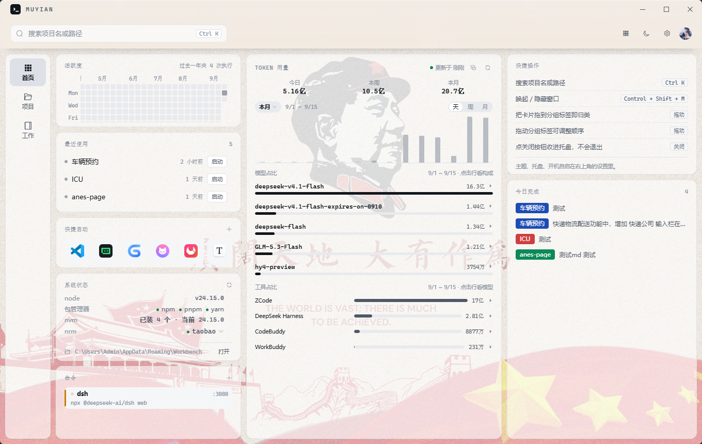
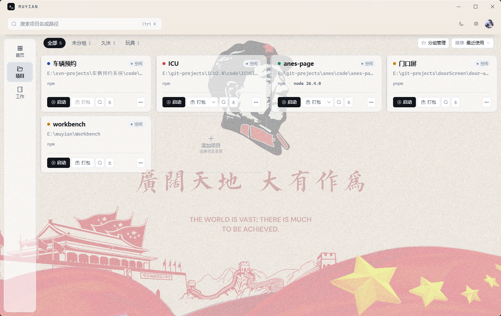
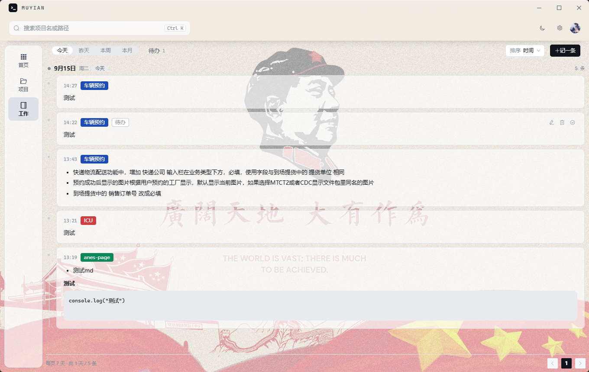
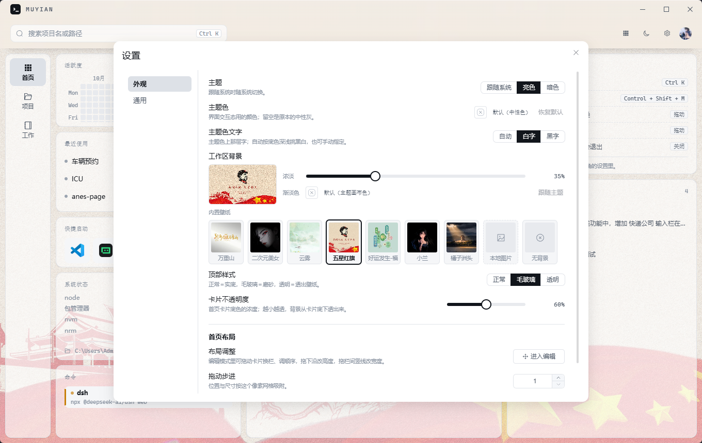

# Workbench

一个跑在 Windows 上的本地开发工作台 —— 管项目、记工作、写笔记、看 AI 用量。

一次添加项目目录，之后一键装依赖、一键启动、一键打包；命令输出在应用内的终端面板里实时可见，随时可停。
此外还有一块可自由布局的首页看板（AI 编程用量、命令活跃度、本机环境、常用软件），
一条按天分组的工作日志，以及一个本机的 markdown 笔记本。

数据都在本机，默认不联网。Tauri 2 + Vue 3 写成。

| 首页 —— 可自由布局的工作台 | 项目 —— 一键启停与打包 |
|---|---|
|  |  |
| 工作 —— 按天分组的工作日志 | 设置 —— 外观 / 菜单 / 通用 / 关于 |
|  |  |

## 能做什么

- **首页工作台**：顶上是一行和这台机器有关的话 —— 一句按时间段的称呼（后面跟着当前登录账号的用户名，没登录时是设置里的程序名），加几条从本机数据里现取的实话（几个项目在跑、今天跑了几次、连着用了多少天）。下面九块可自由布局的卡片（活跃度、Coding 用量、系统状态、我的项目、快捷操作、快捷启动、命令、今日完成、AI 热点），卡片位置、栏数、栏宽、行的划分与高度随拖随存 —— 拖到另一张卡片的上 / 下缘就另起一行，拖到中间就并进那一行、几张并排平分栏宽；不看的可以在设置里关掉；左侧导航栏显示哪几页也能配。
- **记得你的习惯**：上次停在哪一页、项目页怎么排的、工作页在看哪一档、笔记树摊开了哪几层、上次看到哪个视频，下次打开还停在那儿。这几项只对本机成立，不跟着外观配置同步到别的机器。
- **项目管理**：选目录即读 `package.json`，认出框架、scripts、锁文件与包管理器；支持分组、排序、项目标识色，目录被挪走可重新定位。
- **一键操作**：安装依赖 / 启动 / 打包 / 停止 / 重启。打包完自动打开产物目录；从启动日志里认出端口，被别的进程占用时提示占用者并可直接结束它。
- **终端面板**：同一项目的一类操作各占一个 Tab，输出互不覆盖，停止按进程树收干净；面板可收进窗口右缘的一颗悬浮按钮。
- **工作日志**：按天分组的时间轴，记录可关联项目、标待办 / 已完成，正文按 markdown 渲染。**只在本机**：它不写进数据文件、也不随同步走。
- **笔记**：选一个本机文件夹当笔记本，里面的目录结构直接变成左边的目录树（文件夹排在文件前面，文件可拖进文件夹，两栏之间的宽度可拖；左栏底部点一下笔记本名就弹出最近打开过的那几个，随时换回去），右边 Vditor 写 markdown，边写边存 —— 正文就是那个文件夹里的 `.md` 文件，拿别的编辑器改也成立；新建 / 改名 / 删除都在树的右键菜单上（右击空白处新建在最外层）。粘贴的图片会传到你配置的图片仓库（按「本机设备 / 笔记本」分层存放），正文里留一条外链；左栏底部的**素材管理**只看这个笔记本传上去的那些图，数出每张被引用了几次，并支持把没人引用的批量删掉（一次提交推到仓库）。笔记本身也能同步：把那个文件夹做成一个连了远端的 git 仓库（clone 或 `git init` + `remote add`），左栏那颗同步按钮就把它与远端对齐一次（提交 / 拉取 / 推送，冲突交给你手工合）—— 数据只在你自己那个仓库里。
- **技能**：管理一批自定义的 skill（一个文件夹 + 一份带 frontmatter 的 `SKILL.md`），名字与描述从清单里自动提取。技能库就是**你自己挑的那个文件夹**（技能页上选一次就记住了）—— 它与笔记文件夹没有关系：可以正好是同一个目录、同一个仓库，也可以各有各的；它落在哪个仓库里由磁盘决定（从那个目录往上找最近的 `.git`）。每次增删改自动记一版（版本就是 git 历史，可随时恢复），技能页那颗同步按钮把技能库那一层提交并推上去；选一个项目就能把技能一键安装到它的 `.agents/skills/` 下（覆盖前会确认）。
- **知识库**：把一个独立维护的知识库项目文件夹（`kb/` 放整理好的条目，原始资料放库里的 `data/raw/`、或者挂上外面已有的文件夹）接进来：原始数据清单标出「未入库 / 有更新 / 已入库」（条目 frontmatter 的 `source` 指回原始文件，按修改时间比对），工具条那颗「检测更新」手动重扫一遍并报出变化；「开始清洗」把待处理清单交给内置的 AI Agent 整理成条目，跑完自动重建全库目录与机器读的 `index/index.json`，全程在清洗面板里看得见（缺模型 / 密钥就地说明）；条目清单可搜索、点开只读渲染；仓库连了远端时也能在这里同步。
- **AI 助手**：一个**通用的 agent 控制台** —— 选一个工作目录、写一条指令（比如让某个资料文件夹按你自己的规范整理成文），应用内置的开源编码 Agent [Pi](https://pi.dev) 就去那个目录里干活（需要本机有 Node 22.19+），过程与结果画在面板上。目录与任务都由你定；**左边那一栏是工具权限**：「自动编辑」读写文件不问、执行命令前先问你（命令原文摆在运行面板里，点允许 / 拒绝），「完全访问」则什么都不再问。**模型在「模型管理」里配**：加一个 AI 服务（挑一家预设厂商，或者自定义 Base URL + API 格式 —— 网关、中转、本地服务都能接），粘上 API Key 就自动把那个端点的模型列表拉回来、勾几个要用的（上下文长度与思考档位跟着填好，也能自己改）；API Key 进 Windows 凭据管理器，界面读不回来。顶上选定默认模型，页面上随时能换。跑的过程能看到它读了 / 写了哪些文件，随时可以停。
- **密码保险库**：一个密码备忘（不是密码管理器）—— 一条记录就是名字、密码、备注加一个分组，一张卡片；密码默认遮住，一键复制、一键查看，添加与编辑走弹框。**非对称加密**（一把 ECDH P-256 密钥对，每条记录单独走一次 ECIES：临时密钥对 → ECDH → HKDF → AES-256-GCM）—— 有公钥就能往里写，没有私钥谁也读不出来；密钥**只存在本机**（Windows 凭据管理器），仓库里那份从头到尾都是密文。密文放在同步仓库的 `vault/vault.json`，**所有设备公用一个文件**：按 id 取并集、每条取改动时间新的那份，两台机器同时改也不需要人工挑边。另一台机器靠导出 / 导入密钥文件接进来。
- **视频**：选一个本机文件夹当视频库，里面的目录结构（只到 `.mp4`）变成左边的目录树（整栏可收起，播放器占满整屏），点一个立刻开播；空格播放 / 暂停、← / → 快退快进、↑ / ↓ 调倍速，左栏底部能换回最近打开过的目录。视频按文件交给 webview 自己读，不走整份复制；**上次看到哪个视频，下次进页面直接接上、停在开头不自动出声**（文件被删了就自动忘掉）。
- **Coding 用量**：读本机 ZCode / DeepSeek Harness / CodeBuddy / WorkBuddy 的 token 用量与 Qoder 的额度消耗，按天 / 周 / 月看趋势与占比（两个口径在标题行切换）；可选多机同步（各机器的用量相加）。
- **账号登录**：用一个已有的 GitHub / Gitee 账号登录（OAuth 应用构建期内置，使用者零配置），凭据存进 Windows 凭据管理器。
- **系统集成**：全局快捷键、关闭即收进托盘、开机自启、数据目录可整体迁移、内置壁纸与自定义工作区背景。

## 技术栈

| 层 | 选型 |
|---|---|
| 桌面框架 | Tauri 2（Windows 上走系统 WebView2，不随包附带 Chromium） |
| 后端 | Rust（窗口 / 托盘 / 单实例、子进程与日志、文件与 sqlite、系统能力） |
| 前端 | Vue 3（组合式 API + `<script setup>`）+ Element Plus + Pinia |
| 构建 | Vite 8（渲染层，打包器是 rolldown）+ cargo / Tauri CLI |
| 持久化 | 本地 JSON（Rust 侧防抖落盘，临时文件 + rename） |
| 打包 | Tauri CLI → NSIS 安装包（Windows x64） |

架构上**后端刻意做薄**：它只提供「取原始数据 / 落盘 / 调系统能力」，合并、排序、状态机、命令构造这些业务语义都在渲染层的适配层（`apps/desktop/src/renderer/src/workbench/`）里，绝大多数改动因此仍是秒级热更新。

仓库是 **pnpm monorepo**：应用自包含在 `apps/desktop/`（渲染层 + Rust + 随包资源 + 构建脚本），跨页面复用的纯逻辑按域拆成 `packages/` 下 13 个 `@workbench/*` 包（core / notes / video / appearance / terminal / kb / skills / ai / usage / work-log / vault / auth / weather），目录细节见[功能与架构](docs/features-and-architecture.md)的「目录结构」。

## 快速开始

需要 Windows、Node.js、pnpm（`npm i -g pnpm` 或 `corepack enable`，版本钉在根 package.json 的 `packageManager`）与 Rust stable（`x86_64-pc-windows-msvc`）+ MSVC 生成工具 + Windows SDK。

```bash
pnpm install

pnpm run dev        # 开发态（Rust 后端 + 渲染层热更新）
pnpm test           # Vitest 单元测试（各包聚合）
pnpm run typecheck  # 类型检查
pnpm run dist       # 打包出 NSIS 安装包
```

发版走 GitHub Actions（`.github/workflows/release.yml`），**先把版本号写进仓库提交，再打 tag**：

```bash
pnpm run bump 0.2.1     # 版本写进 package.json / tauri.conf.json / Cargo.toml + Cargo.lock，
                        # 并把「该 git add 哪几处」打在输出里（packages/* 是私有子包，钉在 0.0.0 不参与版本）
# 按它给的 git add / git commit（chore: 版本号 0.2.1）提交那一笔，然后：
git tag v0.2.1 && git push origin main v0.2.1
```

推上 tag 之后流水线先跑 `typecheck` 与单元测试，再在 windows-latest 上打 Windows x64 的 NSIS 安装包，
最后建 Release 并把安装包挂上去（`tag` 可以带预发布后缀，如 `v0.2.1-rc.1`，那样会标成 prerelease）。
**tag 与仓库里那几处版本对不上就会停在版本校验那一步**（它就是 `pnpm run bump --check <版本>`，同一个脚本、
同一份清单），提示你先跑 bump —— 所以 clone 这个 tag 出来就是那个版本，本地 `pnpm run dist` 打的包不会与发布包
同名同版本。Release 正文暂时是 GitHub 自动生成的 notes（仓库一路直推 main、没有 PR，所以它基本只有一条
Full Changelog 链接）。

想让发布出来的包**登录可用**，得先给仓库配一个 `OAUTH_LOCAL_JSON` Secret（内容就是本机 `apps/desktop/src-tauri/oauth.local.json` 的原文）；
没配也能构建，只是那个包里登录按钮显示「未内置凭据」。

用 Token 多机同步、要让笔记里粘贴的图片自动上传、或者要同步笔记 / 知识库的话，还需要系统里有 `git`
（Token 同步那项先登录账号即可不用单独配凭据）。**想让笔记或知识库同步，得先自己把那个文件夹做成一个连了远端的 git 仓库**
（`git clone` 一个下来，或在文件夹里 `git init` + `git remote add origin <地址>`）再把文件夹选进来 ——
应用不替你创建仓库、也不替你接远端；没有仓库的文件夹就是本机的笔记 / 知识库，页面上连同步按钮都不出现。

**AI 助手那页的 Pi 已随应用内置**（开源编码 Agent，瘦身后 59MB，不给安装包多背一个 Node），
不用另装；只需要系统里有 **Node 22.19 或更新**（跑内置的那份用）。

## 数据与隐私

应用**默认不上报任何数据**，对外发请求的只有这几处，且都是你自己开出来的：
+ Token 用量同步（可选、默认关闭，发往你自己填的那个 git 仓库；密码保险库推的是同一个仓库的另一个目录，
  推上去的只有密文 —— 所以它不是新的出口）
+ 账号登录（点登录时才访问 GitHub / Gitee的授权接口）
+ 笔记里的图片上传（可选、默认关闭，只有填了图片仓库并真的粘贴了图片才推一次）
+ 笔记本身的同步（可选、默认关闭，前提是你那个笔记文件夹自己是个连了远端的 git 仓库，
  只有点了那颗同步按钮才推一次）
+ 技能库的同步（可选、默认关闭，前提是技能库在一个连了远端的 git 仓库里 —— 从它往上找，
  只有点了技能页那颗同步按钮才推一次）
+ 知识库的同步（可选、默认关闭，前提是知识库文件夹自己是个连了远端的 git 仓库，
  只有点了知识库页那颗同步按钮才推一次；扫描、读条目这些日常浏览都不出网）
+ AI 助手用的模型端点（可选、默认关闭，Base URL / API 格式 / 模型 / API Key 都配齐、并且点了「开始」
  才会由那个子进程直接发给你自己配的那个端点；**它在工作目录里读到的内容会发出去**。
  它自己的遥测与版本检查由应用在起进程时关掉）
+ 以及命令执行本身（`npm install`、dev server 之类，不属于应用的行为）。

> 数据固定落在 `%APPDATA%/Workbench/data/`（不跟着任何设置走）：项目与设置、Token 用量快照、
工作日志、本机设备标识、密码保险库。登录账号的 access_token **不进数据文件**，存在 Windows 凭据管理器里 ——
保险库那把密钥也在那里（它是解开全部密码的唯一一把钥匙，落进数据目录等于把明文密码摊在盘上）。
Token 同步只推模型名与计数，**不含对话内容**；工作日志刻意只留在本机，而笔记就在你自己选的那个
文件夹里 —— 应用既不复制它，也不把它写进任何数据文件（笔记里粘贴的图片进的是你自己填的那个
图片仓库，正文里只留一条外链）。

## 文档
- [功能与架构](docs/features-and-architecture.md)：跨模块的通用事实（壳层、技术栈、目录结构、数据与隐私）与模块索引
- [模块文档](docs/modules/)：每个模块一份 `<模块>.md` —— 开头「约束」一节是不能破的规矩，后面是实现细节（怎么做的、为什么、数据落在哪）
- [开发笔记](docs/dev-notes/)：构建性能、浏览器里做视觉验证的动手方法
- [AGENTS.md](AGENTS.md)：工程约束（给 AI 编码 Agent 看的项目规则；跨模块的规矩在这里，模块文档的索引在第 5 节）
